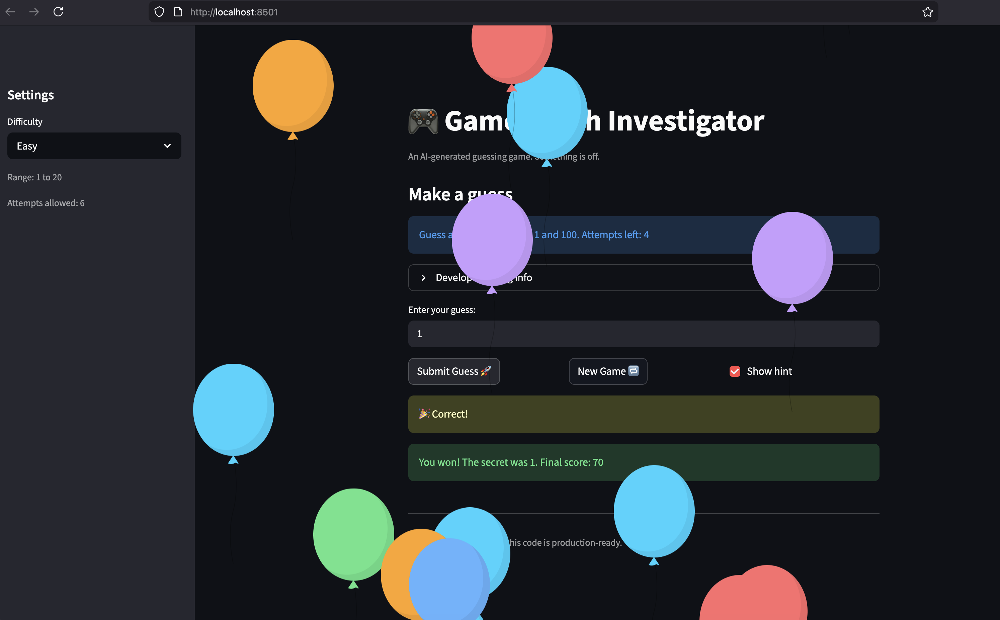
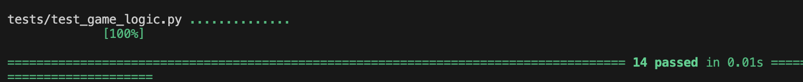

# 🎮 Game Glitch Investigator: The Impossible Guesser

## 🚨 The Situation

You asked an AI to build a simple "Number Guessing Game" using Streamlit.
It wrote the code, ran away, and now the game is unplayable. 

- You can't win.
- The hints lie to you.
- The secret number seems to have commitment issues.

## 🛠️ Setup

1. Install dependencies: `pip install -r requirements.txt`
2. Run the broken app: `python -m streamlit run app.py`

## 🕵️‍♂️ Your Mission

1. **Play the game.** Open the "Developer Debug Info" tab in the app to see the secret number. Try to win.
2. **Find the State Bug.** Why does the secret number change every time you click "Submit"? Ask ChatGPT: *"How do I keep a variable from resetting in Streamlit when I click a button?"*
3. **Fix the Logic.** The hints ("Higher/Lower") are wrong. Fix them.
4. **Refactor & Test.** - Move the logic into `logic_utils.py`.
   - Run `pytest` in your terminal.
   - Keep fixing until all tests pass!

## 📝 Document Your Experience

- [x] **Describe the game's purpose.**
  With varying degrees of difficulty, the game lets a user guess a randomly selected number within a limited number of attempts, with hints provided after each guess. If the player guesses the number before the attempts expire, they win. Otherwise they lose and can start a new game or adjust the difficulty level.

- [x] **Detail which bugs you found.**
  - **Bug 1 — “Go Higher/Lower” Logic:** The hint logic was reversed, telling the player to go in the wrong direction.
  - **Bug 2 — Restart Game:** The game did not clear its state properly, so starting a new game would carry over stale values.
  - **Bug 3 — Difficulty Not Updating:** The functions were not correctly applying the difficulty parameters selected by the user.

- [x] **Explain what fixes you applied.**
  All three bugs were fixed, and the core game logic was moved into `logic_utils.py` for a cleaner, more testable codebase.

## 📸 Demo

- [x] 

## 🧪 Tests

- [x] 

## 🚀 Stretch Features

- [ ] [If you choose to complete Challenge 4, insert a screenshot of your Enhanced Game UI here]
